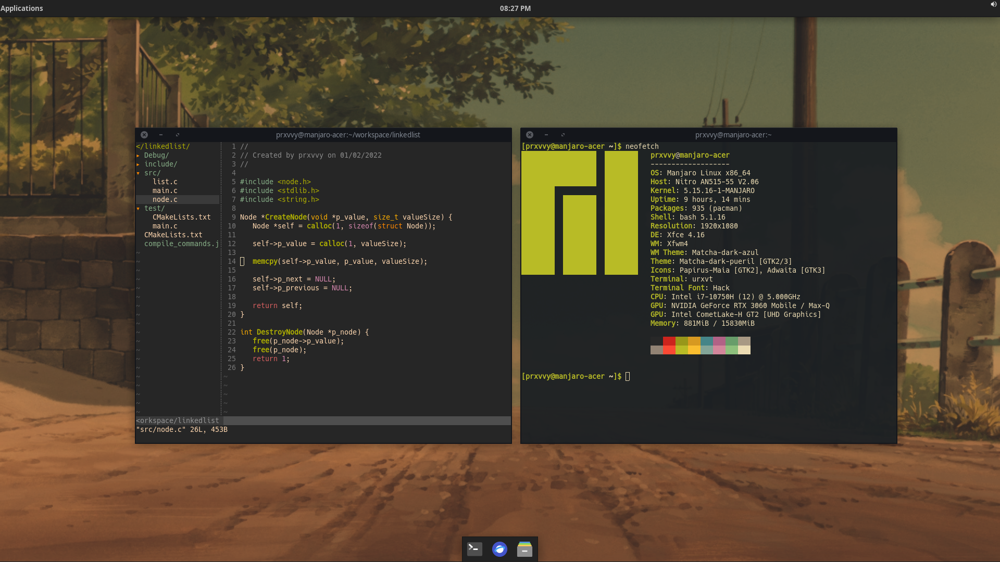

 I use Arch btw! Alright, no, I don't
 
GNU/Linux distro: [Manjaro](https://manjaro.org/). Why? Because it's really good and very similar to Arch but not that much as I'm still a newbie in the GNU/Linux universe, although I'd like to try out arch someday. I'm sure the next GNU/Linux distro I'll try out is debian or arch, because I like to got a very very very veryminimalist OS, which is not what I'm getting from Manjaro atm as it still brings some default sotfware (even if you've got the minimalist version) I never use, but it ain't no that bad.

Desktop Environment: [Xfce](https://xfce.org/). I use this one because it's the one that comes with Manjaro Xfce edition by default (that's a little obvius). This is what I meant by some default software, while I really like Xfce because it's very lightweight, it's not the one I'd like to use, and you may say: "okay try other Manjaro editions then", and I have, I tried Gnome and KDE but I don't like them as consume a lot of memory and memory management is important to me. I'd really like to try out i3 on Debian or Arch someday.

Terminal Emulator: [urxvt](https://archlinux.org/packages/community/x86_64/rxvt-unicode/). Because it's really fast. I've tried Alacritty and trust me, this one's better than that.

Font: [Hack NF](https://github.com/ryanoasis/nerd-fonts/tree/master/patched-fonts/Hack).

Colorscheme: #HailGruvbox.

Text Editor: VS code. Ok no. Obviously [vim](https://www.vim.org/).

