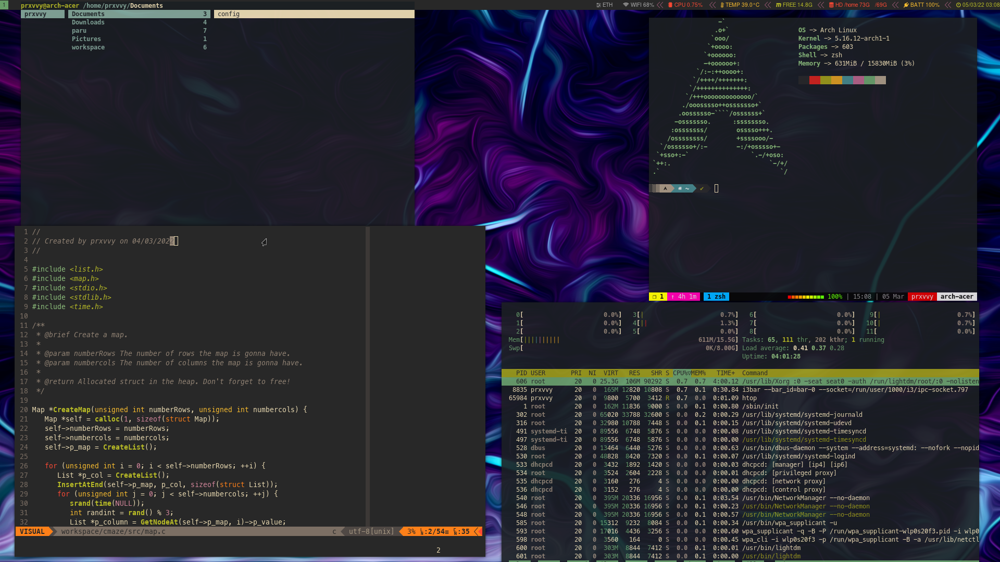

ATM I'm making the script to be able to link all the files and dirs (not ready yet)
I assume you've got stow installed as well are in a Unix-like system to install
neofetch, i3 and xresources files.

