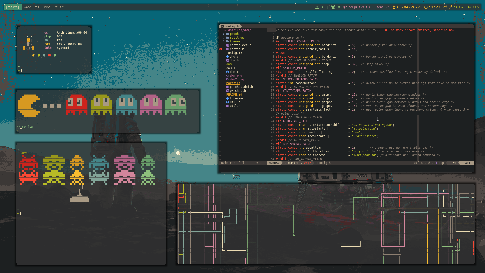
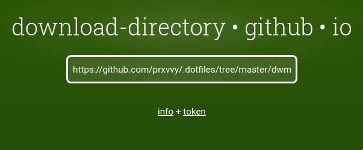

# dwm

This build is built with [dwm-flexipatch](https://github.com/bakkeby/dwm-flexipatch) and well as the [st](https://github.com/prxvvy/.dotfiles/tree/master/st) build

I included some nice patches you may like, but if not uninclude them in [patches.h](https://github.com/prxvvy/.dotfiles/blob/master/dwm/patches.h) config file. And again you can build your own from scratch by just cloning [dwm-flexipatch](https://github.com/bakkeby/dwm-flexipatch) repo.

# Installation

First off, clone my dotfile repo if you haven't yet.

```sh
$ git clone https://github.com/prxvvy/.dotfiles
```
If just want to get my dwm config, which I doubt because of dwmblocks, you can also just get only this directory by just heading over [download-directory.github.io/](https://download-directory.github.io/), typing https://github.com/prxvvy/.dotfiles/tree/master/dwm in the textbox, and hitting enter.

This way



But if cloned the repo, after that just do.

```sh
$ cd dwm && sudo make clean install
```

# Keybindings

All my keybindings are in [settings/keys.h](https://github.com/prxvvy/.dotfiles/blob/master/dwm/settings/keys.h) header file.

MODKEY is Super also known as Windows key or Mod4. Feel free to modify it to fit your needs.

Side note, I use st so you know that when I reference to terminal.

| Keybinding      | Execs |
| ----------- | ----------- |
| MODKEY + Enter      | Terminal       |
| MODKEY + Shift + x   | Betterlockscreen        |
| MODKEY + b   | /usr/bin/brave        |
| MODKEY + e  | /usr/bin/thunar        |
| MODKEY + Shift + q  | Quit dwm        |
| MODKEY + Control + Shift + q  | Restart dwm on the fly        |
| Fn + Right Arrow  | Increase brightness +10 %        |
| Fn + Left Arrow  | Decrease brightness -10 %        |
| Fn + Up arrow | Increase volume +5 %        |
| Fn + Down Arrow  | Decrease volume -5 %        |
| MODKEY + Shift + h      | Resize window to the left       |
| MODKEY + Shift + l      | Resize window to the right       |
| MODKEY + Shift + j      | Resize window up       |
| MODKEY + Shift + k      | Resize window down       |
| MODKEY + h      | Move left       |
| MODKEY + l      | Move right      |
| MODKEY + q     | Close window       |
| MODKEY + Tab     | Cycle layouts       |