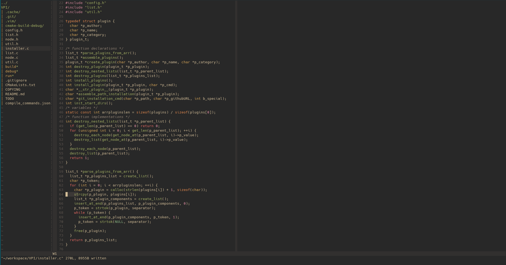

# Installation

 Clone the repo if you haven't yet.
 
 ```shell
 $ cd
 $ git clone https://github.com/prxvvy/.dotfiles
 $ cd .dotfiles && stow --adopt ./vim
 ```
 
 # Plugins
 
 To install plugins use [VPI](https://github.com/prxvvy/VPI)